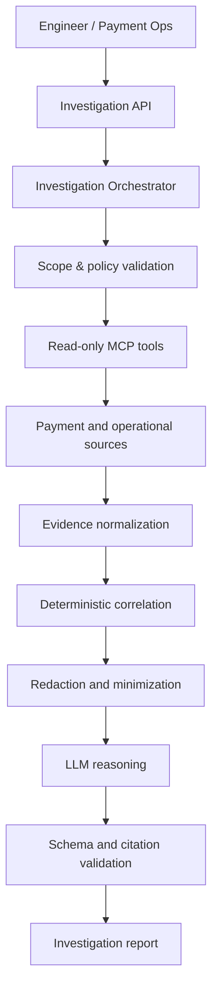

# PayLens Ops AI

**AI-powered payment operations and transaction investigation, grounded in evidence.**

PayLens helps engineers and payment operations teams investigate failed, delayed, duplicated, mismatched, or suspicious transactions by correlating payment records, lifecycle events, logs, traces, provider responses, retries, deployment context, settlement data, reconciliation records, and runbooks.

> **Evidence first, AI second.** The language model is not a source of truth. PayLens uses deterministic processing and tightly scoped, read-only tools to gather and correlate evidence before AI reasoning begins.

> Status: design and foundation phase. The first release will be a safe, read-only local demo built entirely with synthetic payment services and data.

## Product direction

A payment issue is rarely visible in one system. A transaction can cross an API gateway, authentication service, payment processor, message broker, provider adapter, database, retry or reversal workflow, and settlement process.

PayLens turns that fragmented investigation into one controlled path:

1. **Find** — retrieve the transaction and its current state.
2. **Trace** — reconstruct its journey across systems.
3. **Investigate** — explain why it failed or behaved unexpectedly.
4. **Correlate** — identify other transactions affected by the same problem.
5. **Reconcile** — compare platform, provider, reversal, and settlement states.
6. **Recommend** — propose the safest next checks or operational action.

Initial releases remain read-only and never execute production remediation automatically.

## Who it is for

- **Software engineers and SREs:** locate the initiating failure, distinguish it from secondary errors, identify deployment or dependency changes, and assess blast radius.
- **Payment operations analysts:** determine the true transaction state, identify platform/provider disagreements, and detect reversal, duplicate, settlement, or reconciliation issues.

## Example investigation

```text
Investigate transaction TXN-938271 between 14:03 and 14:08 UTC.
Why did it fail, and are other transactions affected?
```

PayLens returns a structured report containing:

- a deterministic transaction timeline;
- platform, provider, reversal, and settlement states;
- ranked hypotheses linked to evidence IDs;
- related transactions sharing the same bounded failure pattern;
- unknowns and missing evidence;
- safe recommended checks.

```json
{
  "transactionId": "TXN-938271",
  "status": "probable_cause_identified",
  "confidence": 0.86,
  "summary": "The authorization timed out after provider latency exceeded the configured deadline.",
  "paymentState": {
    "platform": "FAILED",
    "provider": "UNKNOWN",
    "settlement": "NOT_APPLICABLE"
  },
  "rootCause": {
    "cause": "Provider latency exceeded timeout",
    "supportedBy": ["evt-006", "evt-009", "metric-003"]
  },
  "relatedTransactions": {
    "count": 26,
    "pattern": "provider_timeout"
  },
  "unknowns": ["Provider-side transaction state is unavailable"],
  "recommendedChecks": [
    "Query provider transaction status",
    "Check whether retry generated a second authorization"
  ]
}
```

## Architecture



The full flow and data contracts are documented in [Project flow](docs/project-flow.md), with supporting detail in [Architecture](docs/architecture.md), [Roadmap](docs/roadmap.md), and [Security](docs/security.md).

## Planned read-only tools

| Tool | Purpose |
|---|---|
| `get_transaction` | Retrieve normalized transaction state and identifiers |
| `get_payment_events` | Retrieve payment lifecycle events |
| `search_logs` | Search approved logs by identifier, service, and time |
| `get_trace` | Retrieve a distributed trace |
| `get_service_metrics` | Retrieve approved service and dependency metrics |
| `get_kubernetes_events` | Retrieve workload and deployment events |
| `get_provider_context` | Retrieve normalized provider request/response evidence |
| `find_related_transactions` | Find transactions with the same bounded failure pattern |
| `get_reconciliation_context` | Compare transaction, reversal, provider, and settlement state |
| `find_runbook` | Retrieve relevant operational guidance |

Every response carries a stable evidence ID, source and timestamp, correlation identifiers, redaction metadata, and provenance information.

## Architectural principles

1. **Evidence before explanation:** every material conclusion must cite supporting evidence.
2. **Deterministic work before model work:** parsing, ordering, correlation, comparison, and redaction happen in code.
3. **Technical state is not financial state:** a platform timeout does not prove provider decline or failed authorization.
4. **Least privilege:** models receive purpose-built read operations, never arbitrary shell, SQL, or Kubernetes access.
5. **Bounded investigations:** every request has explicit scope, time, source, and result-size limits.
6. **Graceful uncertainty:** missing evidence produces an explicit uncertainty outcome, not fabricated certainty.
7. **Provider independence:** model, telemetry, provider, and storage integrations use adapters.

## Technology direction

| Area | Initial choice |
|---|---|
| MCP tools | TypeScript and MCP SDK |
| Investigation API | Java 21+ and Spring Boot |
| AI integration | Spring AI or a provider-neutral adapter |
| Local cluster | Kind or Minikube |
| Synthetic services | Spring Boot services |
| Messaging | Kafka-compatible local broker |
| Telemetry | OpenTelemetry |
| Logs, traces, metrics | Loki, Tempo, Prometheus |
| Evaluation | Versioned JSONL cases and test runner |

## Delivery sequence

- **Phase 1 — Payment evidence path:** reconstruct one synthetic transaction end to end without an LLM.
- **Phase 2 — AI-assisted investigation:** generate only evidence-linked, schema-validated explanations.
- **Phase 3 — Related failure detection:** determine whether an incident is isolated or systemic.
- **Phase 4 — Reconciliation intelligence:** distinguish technical failure from financial outcome.
- **Phase 5 — Evaluation and security:** add labelled cases, adversarial tests, redaction tests, and regression gates.
- **Phase 6 — Portfolio release:** authentication, audit trail, dashboard, demo, published results, and `v0.1.0`.

## Repository structure

```text
paylens-ops-ai/
├── apps/
│   ├── investigation-api/
│   └── demo-services/
├── packages/
│   ├── ops-mcp-server/
│   ├── evidence-model/
│   ├── correlation-engine/
│   └── evaluation-runner/
├── deploy/
│   ├── local/
│   └── observability/
├── datasets/
│   └── synthetic-incidents/
├── docs/
│   ├── architecture.md
│   ├── project-flow.md
│   ├── roadmap.md
│   └── security.md
└── README.md
```

## Non-goals

- Replacing engineers, SREs, payment operations, or formal incident management.
- Granting an LLM unrestricted production access.
- Executing refunds, reversals, transaction updates, deployment changes, shell commands, or arbitrary SQL.
- Treating model-generated text as evidence.
- Sending raw production logs or payment data to an external model.

## Evaluation

Quality will be measured using root-cause accuracy, evidence precision and recall, timeline accuracy, payment-state accuracy, related-transaction accuracy, reconciliation accuracy, citation validity, unsupported-claim rate, latency, and model cost.

## Project boundary

PayLens Ops AI is an independent open-source and portfolio project. It must not contain or depend on employer source code, credentials, production logs, confidential architecture, customer information, private payment data, or proprietary operational procedures. Public demos and datasets use synthetic or explicitly public data only.

## Contributing

See [CONTRIBUTING.md](CONTRIBUTING.md). Issues should state the user problem, scope, security impact, and acceptance criteria.

## License

Licensed under the [Apache License 2.0](LICENSE).
