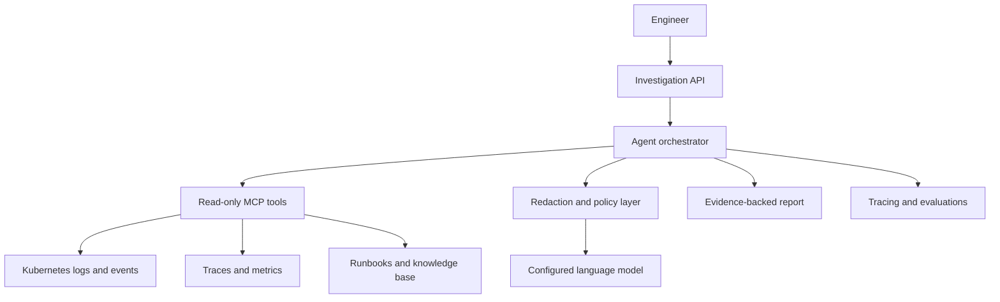

# PayLens Ops AI

**An evidence-first AI incident investigator for Kubernetes and distributed payment systems.**

PayLens Ops AI helps engineers investigate production incidents without manually downloading logs from multiple pods or copying fragments into a chat window. It gathers operational evidence through narrowly scoped tools, correlates events across services, redacts sensitive data, and produces a traceable incident analysis with confidence levels and citations back to the source evidence.

> Status: design and foundation phase. The initial milestone is a safe, read-only local demo using synthetic payment services and generated Kubernetes logs.

## Why this project exists

An incident in a distributed system rarely lives in one log file. A single failed payment may pass through an API gateway, authentication service, transaction processor, Kafka consumer, downstream provider, and database. Engineers often have to:

1. Find the correct cluster, namespace, workload, and time window.
2. Download or stream logs from several pods.
3. Search for a transaction, trace, or correlation identifier.
4. Reconstruct the event timeline manually.
5. Separate the initiating failure from retries and secondary errors.
6. Explain the incident while protecting customer and payment data.

PayLens Ops AI turns that workflow into a controlled investigation. It does not treat an LLM as the source of truth. Logs, traces, metrics, and runbooks remain the evidence; the model helps retrieve, correlate, and explain them.

## Product goals

- Reduce the time required to gather evidence during an incident.
- Reconstruct request journeys across pods and services.
- Produce explanations that cite the exact supporting events.
- Protect PANs, tokens, credentials, personal data, and internal secrets.
- Make uncertain or incomplete evidence explicit.
- Keep production access read-only, scoped, auditable, and revocable.
- Measure investigation quality, latency, and model cost.

## Non-goals

- Replacing engineers, SREs, or formal incident management.
- Giving an LLM unrestricted shell or Kubernetes access.
- Executing remediation actions automatically.
- Training a foundation model.
- Sending raw production logs to an external model provider.
- Claiming a root cause when the available evidence is insufficient.

## Core user experience

An engineer asks:

```text
Investigate transaction TXN-938271 between 14:03 and 14:08 UTC.
Why did it fail, which services were involved, and what should I check next?
```

The system returns a structured report:

```json
{
  "summary": "The authorization request timed out after the downstream provider exceeded its 3-second deadline.",
  "status": "probable_cause_identified",
  "confidence": 0.86,
  "timeline": [
    {
      "timestamp": "2026-09-10T14:04:01.120Z",
      "service": "payment-api",
      "event": "Authorization request accepted",
      "evidenceId": "evt-001"
    },
    {
      "timestamp": "2026-09-10T14:04:04.208Z",
      "service": "provider-adapter",
      "event": "Downstream request timed out",
      "evidenceId": "evt-009"
    }
  ],
  "hypotheses": [
    {
      "cause": "Downstream provider latency exceeded the configured timeout",
      "confidence": 0.86,
      "supportedBy": ["evt-006", "evt-009", "metric-003"]
    }
  ],
  "unknowns": [
    "No downstream provider trace was available for the requested window"
  ],
  "recommendedChecks": [
    "Compare provider latency with its SLO for the same time window",
    "Check whether retries produced a duplicate authorization"
  ]
}
```

## Planned capabilities

### Evidence collection

- List permitted Kubernetes clusters, namespaces, workloads, and pods.
- Fetch logs by service, time window, trace ID, correlation ID, or transaction reference.
- Retrieve previous-container logs for restarted pods.
- Collect Kubernetes events and selected workload metadata.
- Query traces and metrics through provider adapters.
- Retrieve relevant operational runbooks.

### Investigation engine

- Normalize events from different log formats.
- Correlate identifiers across services.
- Reconstruct a chronological request journey.
- Detect timeout, retry, circuit-breaker, dependency, and data-consistency patterns.
- Generate multiple hypotheses and rank them by evidence.
- Distinguish observations, inferences, and unknowns.
- Produce structured, machine-readable reports.

### Safety and governance

- Read-only Kubernetes permissions.
- Namespace and workload allowlists.
- Query limits and bounded time windows.
- Data redaction before model invocation.
- Prompt-injection-resistant treatment of log content as untrusted data.
- Audit records for every user query and tool call.
- Configurable model routing for environments where data must remain internal.
- No autonomous remediation in the initial releases.

### AI operations

- Evaluation dataset built from synthetic incidents.
- Retrieval-quality and root-cause-quality metrics.
- Hallucination and unsupported-claim checks.
- Model latency, token usage, failure rate, and cost tracking.
- Regression tests for prompts, tool schemas, and model changes.

## Proposed architecture



### Architectural principles

1. **Evidence before explanation:** every material conclusion must reference retrieved evidence.
2. **Deterministic work before model work:** filtering, parsing, ordering, correlation, and redaction should happen in code.
3. **Least privilege:** the MCP server exposes purpose-built read operations rather than arbitrary shell execution.
4. **Bounded investigations:** every request has explicit scope, time, and result-size limits.
5. **Provider independence:** model and observability integrations use adapters.
6. **Graceful uncertainty:** missing evidence results in an `insufficient_evidence` outcome, not invented certainty.

## Initial technology direction

The exact implementation will be confirmed through short architecture spikes.

| Area | Initial choice | Reason |
|---|---|---|
| MCP tools | TypeScript and MCP SDK | Strong ecosystem support and small tool surface |
| Investigation API | Java 21+ and Spring Boot | Production-grade service foundation and alignment with payment-system experience |
| AI integration | Spring AI or provider-neutral adapter | Structured outputs, tool calling, and model portability |
| Local cluster | Kind or Minikube | Reproducible Kubernetes demo |
| Synthetic services | Spring Boot services | Realistic distributed transaction flow |
| Messaging | Kafka-compatible local broker | Retry and asynchronous-processing scenarios |
| Telemetry | OpenTelemetry | Vendor-neutral traces, metrics, and logs |
| Trace backend | Grafana Tempo | Local distributed tracing |
| Log backend | Grafana Loki | Central log queries without pod-by-pod downloads |
| Metrics | Prometheus | Service and dependency signals |
| Evaluation | Versioned JSONL cases and test runner | Repeatable, reviewable quality checks |

## MCP tool contract—first iteration

The model will not receive a generic `kubectl` or terminal tool. It will use constrained operations such as:

| Tool | Purpose | Important limits |
|---|---|---|
| `list_workloads` | Discover allowed workloads | Allowlisted namespaces only |
| `search_logs` | Search logs using identifiers and time | Maximum window and result count |
| `get_trace` | Retrieve a distributed trace | Exact trace ID or bounded search |
| `get_kubernetes_events` | Retrieve relevant cluster events | Read-only and namespace-scoped |
| `get_service_metrics` | Query selected operational metrics | Approved queries and time range |
| `find_runbook` | Retrieve relevant operational guidance | Curated knowledge source only |

Every tool response will contain stable evidence IDs so the final report can cite its basis.

## Repository structure

```text
paylens-ops-ai/
├── apps/
│   ├── investigation-api/       # Spring Boot orchestration API
│   └── demo-services/           # Synthetic distributed payment workflow
├── packages/
│   ├── k8s-mcp-server/          # Read-only MCP tools
│   ├── evidence-model/          # Shared event and report schemas
│   └── evaluation-runner/       # Quality and regression evaluations
├── deploy/
│   ├── local/                   # Kind/Minikube manifests
│   └── observability/           # OpenTelemetry, Loki, Tempo, Prometheus
├── datasets/
│   └── synthetic-incidents/     # Sanitized evaluation cases
├── docs/
│   ├── architecture.md
│   ├── roadmap.md
│   └── security.md
└── README.md
```

## Delivery roadmap

### Milestone 0 — Foundation

- [x] Define the problem, boundaries, and initial architecture.
- [x] Establish public documentation and contribution conventions.
- [ ] Create architecture decision records for the language and model integration.
- [ ] Add CI for documentation, Java, TypeScript, and secret scanning.

### Milestone 1 — Deterministic local investigation

- [ ] Run synthetic payment services in a local Kubernetes cluster.
- [ ] Generate correlated JSON logs and OpenTelemetry traces.
- [ ] Implement scoped `search_logs` and `get_trace` MCP tools.
- [ ] Reconstruct a request timeline without an LLM.
- [ ] Return a structured evidence bundle.

### Milestone 2 — AI-assisted analysis

- [ ] Add provider-neutral LLM integration.
- [ ] Produce schema-validated investigation reports.
- [ ] Require evidence references for every hypothesis.
- [ ] Add uncertainty and insufficient-evidence outcomes.
- [ ] Trace model calls, tool calls, latency, and token usage.

### Milestone 3 — Safety and evaluation

- [ ] Add configurable redaction policies.
- [ ] Add prompt-injection and malicious-log test cases.
- [ ] Create at least 25 labelled synthetic incidents.
- [ ] Measure evidence precision, cause accuracy, citation validity, latency, and cost.
- [ ] Add regression gates to CI.

### Milestone 4 — Portfolio-quality release

- [ ] Add a minimal investigation dashboard.
- [ ] Publish architecture and threat-model documentation.
- [ ] Record a three-minute end-to-end demo.
- [ ] Publish benchmark results and known limitations.
- [ ] Tag `v0.1.0`.

See [the detailed roadmap](docs/roadmap.md).

## Evaluation strategy

The project will not be judged by whether a demo answer sounds convincing. Each synthetic incident will include:

- A known initiating fault.
- Expected services and event sequence.
- Relevant and irrelevant evidence.
- Required conclusions and prohibited unsupported claims.
- Expected uncertainty when evidence is intentionally missing.

Initial quality measures:

| Metric | What it measures |
|---|---|
| Evidence precision | How much retrieved evidence is relevant |
| Evidence recall | Whether required events were retrieved |
| Timeline accuracy | Whether event order and service attribution are correct |
| Root-cause accuracy | Whether the initiating fault is identified |
| Citation validity | Whether cited evidence supports each claim |
| Unsupported-claim rate | How often the report exceeds its evidence |
| Investigation latency | End-to-end response time |
| Investigation cost | Model and infrastructure cost per case |

## Security model

Operational logs are sensitive. Before any real-environment integration, the project must enforce:

- Dedicated read-only service accounts and narrowly scoped RBAC.
- No access to Kubernetes Secrets.
- Environment, namespace, workload, time-window, and row-count restrictions.
- Redaction before persistence or transmission to a model.
- Encryption in transit and at rest.
- Authentication, authorization, and immutable audit trails.
- Explicit retention policies.
- Separation of synthetic demo mode from enterprise integrations.

See [the security and threat model](docs/security.md).

## Local development

There is no runnable release yet. The first implementation will target:

```text
Java 21+
Node.js 22+
Docker
Kind or Minikube
```

Setup commands will be added with Milestone 1. Until then, start with the open tasks in the roadmap rather than expecting a functioning application.

## Portfolio narrative

This project demonstrates the engineering required around AI models:

- Distributed systems and Kubernetes operations.
- MCP and constrained tool calling.
- Retrieval and evidence grounding.
- Structured model outputs.
- Security and privacy controls for financial systems.
- Observability and LLMOps.
- Evaluation-driven AI development.
- Production-minded failure handling.

The intended outcome is not “a chatbot for logs.” It is a dependable investigation system whose conclusions can be reviewed, challenged, and audited.

## Contributing

The project is in its foundation phase. Issues should describe the user problem, proposed scope, security impact, and acceptance criteria. See [CONTRIBUTING.md](CONTRIBUTING.md).

## Disclaimer

PayLens Ops AI is an independent portfolio and open-source project. It does not contain, connect to, or represent any employer's proprietary systems, source code, credentials, production logs, customer information, or confidential architecture. All demonstrations and evaluation datasets must use synthetic or explicitly public data.

## License

Licensed under the [Apache License 2.0](LICENSE).
