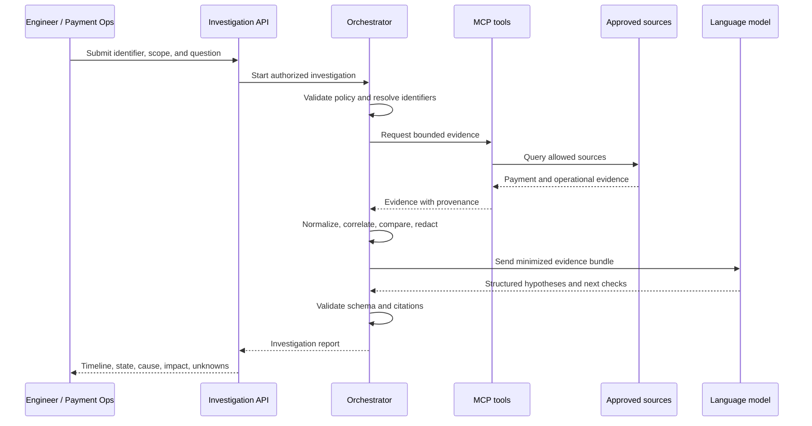

# Architecture

## System context

PayLens Ops AI sits between authenticated engineers or payment operations users and approved payment and operational data sources. It coordinates narrowly scoped retrieval tools, deterministic correlation, and bounded language-model reasoning to produce an evidence-backed investigation report.

The system separates six concerns:

1. **Scope and policy:** authenticate the user and enforce environment, source, time-range, result-size, and sensitive-data constraints.
2. **Collection:** retrieve bounded transaction records, payment events, logs, traces, metrics, deployment events, provider context, reconciliation records, and runbooks.
3. **Evidence processing:** normalize timestamps and states, redact sensitive data, deduplicate events, and retain provenance.
4. **Correlation:** link identifiers, reconstruct timelines, group retries, compare payment states, and find related failures deterministically.
5. **Reasoning:** use a model only over the minimized evidence bundle to compare supported hypotheses and recommend bounded next checks.
6. **Verification:** validate schemas, evidence citations, authorization, and policy compliance before returning a report.

## Investigation sequence



## Logical components

| Component | Responsibility |
|---|---|
| Investigation API | Authentication, request validation, status, and report delivery |
| Investigation Orchestrator | Policy-bound workflow, tool selection, and investigation lifecycle |
| MCP tool layer | Purpose-built, read-only access to approved sources |
| Evidence processor | Normalization, provenance, deduplication, and redaction |
| Correlation engine | Timeline construction, retry grouping, state comparison, and related-pattern matching |
| Model adapter | Provider-neutral structured reasoning over minimized evidence |
| Output validator | Schema, citation, claim-support, and policy validation |
| Evaluation runner | Replayable labelled scenarios and quality regression gates |

## Evidence contract

Each observation has a stable evidence ID and retains:

- source type and source identifier;
- original and normalized timestamps;
- service or system identity;
- transaction, trace, span, and correlation identifiers;
- environment, namespace, or workload where permitted;
- redaction metadata;
- integrity and provenance metadata where applicable.

Model-generated text is never stored or cited as source evidence.

## Deterministic processing

Before model invocation, code performs:

- timestamp normalization and event ordering;
- duplicate removal and correlation-ID matching;
- trace/span association and retry grouping;
- timeout and failure-signature detection;
- platform and provider state normalization;
- reversal/refund matching and settlement comparison;
- sensitive-data redaction and evidence minimization.

## Payment-state model

Technical state and financial state are tracked separately. A timeout can produce:

```json
{
  "platformState": "FAILED",
  "providerState": "UNKNOWN",
  "reversalState": "NOT_FOUND",
  "settlementState": "NOT_APPLICABLE"
}
```

The report must not infer provider decline, failed authorization, or settlement outcome without supporting evidence.

## Investigation outcomes

- `cause_identified`
- `probable_cause_identified`
- `multiple_possible_causes`
- `insufficient_evidence`
- `investigation_blocked`
- `reconciliation_required`

The system prefers `insufficient_evidence` over unsupported certainty.

## Repository modules

| Module | Purpose |
|---|---|
| `apps/investigation-api` | Spring Boot investigation and orchestration API |
| `apps/demo-services` | Synthetic payment API, processor, provider, and reconciliation flows |
| `packages/ops-mcp-server` | Read-only transaction and operational MCP tools |
| `packages/evidence-model` | Shared evidence and report schemas |
| `packages/correlation-engine` | Deterministic timeline, state, and pattern logic |
| `packages/evaluation-runner` | Scenario execution and regression measurement |

## Open decisions

- Spring AI versus a small provider-neutral model adapter.
- Direct Kubernetes log collection versus Loki-first querying.
- Persistence and retention rules for evidence bundles and reports.
- Human feedback model for accepting or rejecting hypotheses.
- Enterprise SSO and identity propagation boundaries.
- Provider and settlement adapter contracts for the synthetic demo.

See [project-flow.md](project-flow.md) for the complete investigation flow.
