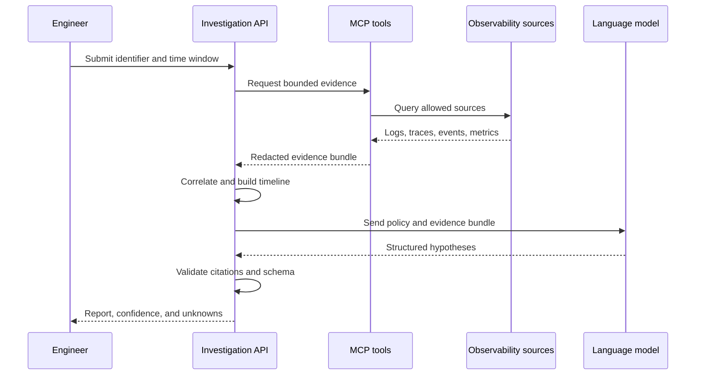

# Architecture

## System context

PayLens Ops AI sits between an authenticated engineer and approved operational data sources. It coordinates narrowly scoped retrieval tools and a language model to create an evidence-backed incident report.

The system is deliberately separated into four concerns:

1. **Collection:** retrieve bounded logs, traces, events, metrics, and runbooks.
2. **Evidence processing:** normalize, redact, correlate, deduplicate, and rank evidence deterministically.
3. **Reasoning:** use a language model to compare supported hypotheses and explain the incident.
4. **Verification:** validate output schemas, evidence citations, policy compliance, and evaluation metrics.

## Investigation sequence

## Evidence model

Every observation receives a stable evidence ID and retains provenance:

- Source type and source identifier.
- Service, environment, namespace, and workload where permitted.
- Original and normalized timestamps.
- Trace, span, correlation, or transaction identifiers.
- Redaction metadata.
- Integrity hash for audit and reproducibility.

Model-generated text is never stored as source evidence.

## Failure modes

The API must represent at least these outcomes:

- `cause_identified`: strong, directly supported evidence.
- `probable_cause_identified`: best-supported hypothesis with meaningful uncertainty.
- `multiple_possible_causes`: evidence supports more than one explanation.
- `insufficient_evidence`: the requested evidence is missing or inconclusive.
- `investigation_blocked`: authorization, source, policy, or infrastructure prevented investigation.

## Open decisions

- Spring AI versus a small provider-neutral model adapter.
- Direct Kubernetes log collection versus Loki-first querying.
- Storage duration for evidence bundles and investigation reports.
- Human feedback model for confirming or rejecting hypotheses.
- Identity propagation and enterprise SSO integration boundaries.
