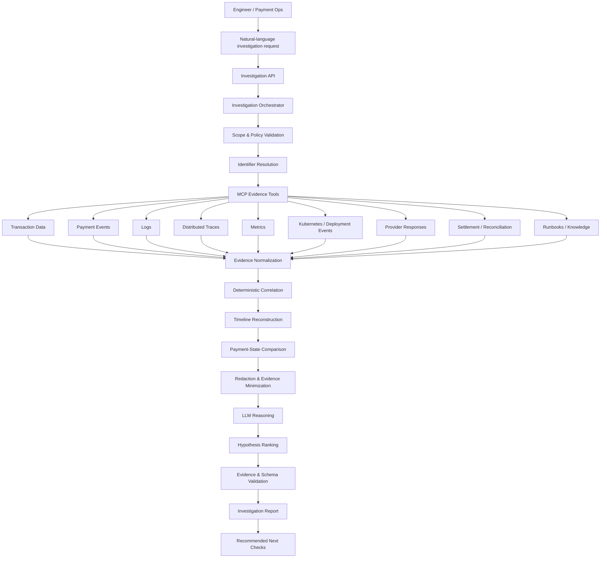
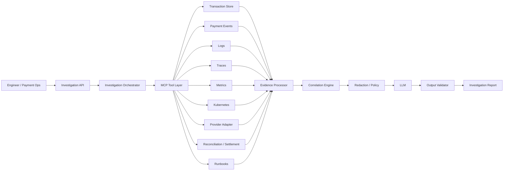

# PayLens Ops AI — Updated Project Flow

## Overview

**PayLens Ops AI** is an AI-powered payment operations and transaction investigation platform.

It helps engineers and payment operations teams investigate failed, delayed, duplicated, mismatched, or suspicious transactions by correlating evidence across payment records, logs, traces, provider responses, retries, settlement data, reconciliation records, and operational runbooks.

The core principle is:

> **Evidence first, AI second.**

PayLens does not treat the language model as the source of truth. The model reasons only over evidence gathered through tightly scoped, read-only tools.

---

## Product Thesis

A payment issue is rarely visible in one system.

A single transaction may pass through:

- API gateway
- authentication service
- payment processor
- message broker
- provider adapter
- database
- retry/reversal workflow
- settlement or reconciliation process

Today, engineers often investigate these systems manually.

PayLens turns that fragmented workflow into a single investigation path.

The product evolves through six stages:

1. **Find** — retrieve a transaction and its current state.
2. **Trace** — reconstruct the transaction journey across systems.
3. **Investigate** — determine why the transaction failed or behaved unexpectedly.
4. **Correlate** — identify other transactions affected by the same underlying problem.
5. **Reconcile** — compare technical state with payment, provider, and settlement state.
6. **Recommend** — suggest the safest next checks or operational action.

Initial releases remain read-only and do not execute production remediation automatically.

---

## Primary Users

### Software Engineer / SRE

Uses PayLens to understand:

- why a transaction failed;
- where in the service chain the failure occurred;
- whether a deployment or dependency change caused the issue;
- whether retries or timeouts created duplicate or ambiguous states;
- whether other transactions are affected.

### Payment Operations Analyst

Uses PayLens to understand:

- the true status of a transaction;
- whether the platform and provider disagree;
- whether a transaction needs reversal, reconciliation, or manual review;
- whether a settlement mismatch exists;
- whether an issue is isolated or systemic.

---

## Core User Questions

PayLens should support questions such as:

```text
What happened to transaction TXN-938271?
```

```text
Why did TXN-938271 fail?
```

```text
Show the complete journey of TXN-938271 across all services.
```

```text
Are other transactions failing for the same reason?
```

```text
Did this transaction fail before or after reaching the provider?
```

```text
Did a retry create a possible duplicate authorization?
```

```text
Why is yesterday's settlement lower than our successful payment records?
```

```text
What changed before these payment failures started?
```

---

## End-to-End Investigation Flow



---

## Detailed Investigation Sequence

### 1. Receive Investigation Request

The user supplies:

- transaction reference, trace ID, correlation ID, or time window;
- optional environment;
- optional service;
- optional question.

Example:

```text
Investigate transaction TXN-938271 between 14:03 and 14:08 UTC.
Why did it fail, and are other transactions affected?
```

### 2. Validate Scope

Before querying any source, PayLens validates:

- user identity;
- environment access;
- namespace/workload allowlists;
- maximum time range;
- maximum result size;
- permitted evidence sources;
- sensitive-data policies.

No unrestricted shell, SQL, or Kubernetes access is exposed to the model.

### 3. Resolve Transaction Context

PayLens retrieves the normalized transaction record.

Example:

```json
{
  "transactionId": "TXN-938271",
  "status": "FAILED",
  "amount": 25000,
  "currency": "NGN",
  "channel": "WEB",
  "provider": "provider-a",
  "correlationId": "CORR-73182",
  "traceId": "TRACE-9ad21",
  "createdAt": "2026-09-10T14:04:01Z"
}
```

The system extracts all identifiers that can connect the transaction to other evidence.

### 4. Gather Evidence

The orchestrator calls read-only MCP tools.

Planned tools:

| Tool | Purpose |
|---|---|
| `get_transaction` | Retrieve normalized transaction state and identifiers |
| `get_payment_events` | Retrieve payment lifecycle events |
| `search_logs` | Search approved logs by identifier, service, and time |
| `get_trace` | Retrieve a distributed trace |
| `get_service_metrics` | Retrieve approved service/dependency metrics |
| `get_kubernetes_events` | Retrieve workload and deployment events |
| `get_provider_context` | Retrieve normalized provider request/response evidence |
| `find_related_transactions` | Identify transactions with similar bounded failure patterns |
| `get_reconciliation_context` | Compare transaction and settlement/reconciliation state |
| `find_runbook` | Retrieve relevant operational guidance |

Every tool response must contain:

- stable evidence ID;
- source type;
- source identifier;
- timestamp;
- service or system;
- correlation identifiers;
- redaction metadata;
- integrity/provenance metadata where applicable.

---

## Evidence Model

Example:

```json
{
  "evidenceId": "evt-009",
  "type": "log",
  "timestamp": "2026-09-10T14:04:04.208Z",
  "service": "provider-adapter",
  "transactionId": "TXN-938271",
  "traceId": "TRACE-9ad21",
  "event": "Downstream request timed out",
  "source": "loki",
  "redacted": true
}
```

Model-generated text is never treated as source evidence.

---

## Deterministic Processing

Before any LLM reasoning, PayLens performs deterministic processing in code.

This includes:

- timestamp normalization;
- event ordering;
- duplicate removal;
- correlation-ID matching;
- trace/span association;
- retry grouping;
- timeout detection;
- transaction-state normalization;
- provider-state normalization;
- reversal/refund matching;
- settlement comparison;
- sensitive-data redaction.

This reduces hallucination risk and model cost.

---

## Transaction Journey Reconstruction

PayLens builds a chronological journey.

Example:

```text
14:04:01.120  payment-api       Request accepted
14:04:01.290  auth-service      Authentication successful
14:04:01.515  payment-processor Authorization started
14:04:01.670  provider-adapter  Provider request sent
14:04:04.208  provider-adapter  Provider timeout
14:04:04.310  payment-processor Transaction marked FAILED
14:04:05.002  retry-worker      Retry scheduled
```

The timeline is produced deterministically from evidence where possible.

---

## Payment-State Comparison

A key PayLens principle is:

> **Technical state is not automatically the same as financial state.**

Example:

```json
{
  "platformState": "FAILED",
  "providerState": "UNKNOWN",
  "reversalState": "NOT_FOUND",
  "settlementState": "NOT_APPLICABLE"
}
```

A platform timeout does not prove that the provider declined the transaction.

This distinction is critical for payment investigations.

---

## AI Reasoning Stage

The minimized evidence bundle is passed to the configured language model.

The model is asked to:

- explain the transaction journey;
- compare plausible hypotheses;
- identify the initiating failure;
- distinguish primary failures from secondary errors;
- identify missing evidence;
- rank hypotheses by support;
- recommend bounded next checks.

The model must never invent evidence.

---

## Hypothesis Example

```json
{
  "hypotheses": [
    {
      "cause": "Provider latency exceeded the configured timeout",
      "confidence": 0.86,
      "supportedBy": [
        "evt-006",
        "evt-009",
        "metric-003"
      ]
    },
    {
      "cause": "Internal connection-pool exhaustion",
      "confidence": 0.18,
      "supportedBy": [
        "metric-006"
      ]
    }
  ]
}
```

---

## Related Transaction Detection

After identifying a likely failure pattern, PayLens can perform a bounded search for similar transactions.

Possible dimensions:

- same provider;
- same response code;
- same timeout signature;
- same service;
- same deployment version;
- same time window;
- same channel;
- same merchant;
- same trace/error signature.

Example:

```json
{
  "pattern": "provider_timeout",
  "affectedTransactions": 27,
  "window": "2026-09-10T14:00:00Z/2026-09-10T14:15:00Z"
}
```

---

## Reconciliation Flow

For transactions where financial state is unclear, PayLens compares:

```text
Platform transaction
        |
        v
Provider response/state
        |
        v
Retry / reversal state
        |
        v
Settlement record
        |
        v
Reconciliation result
```

Possible outcomes:

- fully reconciled;
- platform/provider mismatch;
- possible duplicate;
- missing reversal;
- settlement mismatch;
- unknown due to missing provider evidence.

---

## Final Investigation Report

Example:

```json
{
  "transactionId": "TXN-938271",
  "status": "probable_cause_identified",
  "confidence": 0.86,
  "summary": "The authorization timed out after provider latency exceeded the configured deadline.",
  "paymentState": {
    "platform": "FAILED",
    "provider": "UNKNOWN",
    "settlement": "NOT_APPLICABLE"
  },
  "rootCause": {
    "cause": "Provider latency exceeded timeout",
    "supportedBy": [
      "evt-006",
      "evt-009",
      "metric-003"
    ]
  },
  "relatedTransactions": {
    "count": 26,
    "pattern": "provider_timeout"
  },
  "unknowns": [
    "Provider-side transaction state is unavailable"
  ],
  "recommendedChecks": [
    "Query provider transaction status",
    "Check whether retry generated a second authorization",
    "Compare provider latency with its SLO"
  ]
}
```

---

## Investigation Outcomes

PayLens should explicitly represent uncertainty.

Supported outcomes:

- `cause_identified`
- `probable_cause_identified`
- `multiple_possible_causes`
- `insufficient_evidence`
- `investigation_blocked`
- `reconciliation_required`

The system must prefer `insufficient_evidence` over fabricated certainty.

---

## Safety Model

### Read-only by default

Initial PayLens versions must not:

- restart pods;
- edit deployments;
- execute arbitrary SQL;
- execute shell commands;
- trigger refunds;
- trigger reversals;
- alter transaction state;
- modify settlement records.

### Sensitive Data

PayLens must protect:

- PANs;
- CVVs;
- tokens;
- API keys;
- credentials;
- customer personal data;
- internal secrets.

Redaction happens before model invocation.

### Prompt Injection

Logs, provider payloads, runbooks, and external text are treated as untrusted data.

They must never be able to:

- expand permissions;
- alter system policy;
- request hidden credentials;
- cause arbitrary tool execution.

---

## System Architecture



---

## Proposed Repository Structure

```text
paylens-ops-ai/
├── apps/
│   ├── investigation-api/
│   └── demo-services/
├── packages/
│   ├── ops-mcp-server/
│   ├── evidence-model/
│   ├── correlation-engine/
│   └── evaluation-runner/
├── deploy/
│   ├── local/
│   └── observability/
├── datasets/
│   └── synthetic-incidents/
├── docs/
│   ├── architecture.md
│   ├── project-flow.md
│   ├── roadmap.md
│   └── security.md
└── README.md
```

---

## Delivery Plan

### Phase 1 — Payment Evidence Path

Build synthetic payment API, payment processor, provider adapter, transaction datastore, correlated logs, and OpenTelemetry traces.

Implement:

- `get_transaction`
- `get_payment_events`
- `search_logs`
- `get_trace`

**Success criterion:** one synthetic transaction can be reconstructed end to end without an LLM.

### Phase 2 — AI-Assisted Investigation

Add provider-neutral model integration, a structured investigation-report schema, evidence-linked hypotheses, uncertainty handling, and model/tool tracing.

**Success criterion:** the model explains an incident only using cited evidence.

### Phase 3 — Related Failure Detection

Add failure-pattern extraction, bounded transaction correlation, provider/service health comparison, and deployment-change context.

**Success criterion:** PayLens can determine whether an incident is isolated or systemic.

### Phase 4 — Reconciliation Intelligence

Add provider-state comparison, retry/reversal scenarios, settlement records, and reconciliation rules.

**Success criterion:** PayLens can distinguish technical failure from financial outcome.

### Phase 5 — Evaluation and Security

Add labelled synthetic incident datasets, adversarial log cases, prompt-injection tests, redaction tests, and quality regression gates.

Measure:

- root-cause accuracy;
- evidence precision;
- evidence recall;
- payment-state accuracy;
- related-transaction accuracy;
- reconciliation accuracy;
- citation validity;
- unsupported-claim rate;
- latency;
- model cost.

### Phase 6 — Portfolio Release

Add authentication, authorization, audit trail, minimal investigation dashboard, recorded demo, architecture documentation, published evaluation results, and tagged `v0.1.0`.

---

## Example Demo Scenario

A synthetic provider becomes slow after a deployment.

Twenty-seven payments begin timing out.

An engineer asks:

```text
Why are payments failing?
```

PayLens:

1. detects the increase in failed transactions;
2. identifies their shared provider dependency;
3. retrieves the related traces;
4. correlates provider latency metrics;
5. detects the deployment/change window;
6. reconstructs representative transaction journeys;
7. determines that platform timeouts occur before a provider result is returned;
8. identifies potentially ambiguous transactions;
9. recommends provider-status checks and duplicate/reversal verification.

This demonstrates more than log summarization.

It demonstrates **AI-assisted payment operations investigation**.

---

## Long-Term Direction

Future versions may support controlled actions such as:

- creating an incident ticket;
- opening a reconciliation case;
- generating a merchant-support explanation;
- preparing a reversal request;
- generating an incident report;
- recommending rollback or configuration changes.

Any production-changing action should require explicit human approval and separate authorization.

---

## Positioning

PayLens should be described as:

> **An AI-powered payment operations and transaction investigation platform that correlates payment data, logs, traces, provider responses, and reconciliation evidence to explain what happened and what should be checked next.**

The differentiation is not simply that it uses an LLM.

The differentiation is that it combines:

- payment-domain context;
- distributed-system observability;
- MCP-based constrained tools;
- deterministic evidence correlation;
- evidence-grounded AI reasoning;
- payment-state reconciliation;
- explicit uncertainty;
- production-grade security controls.

---

## Project Boundary

PayLens Ops AI is an independent open-source and portfolio project.

It must not contain or depend on:

- employer source code;
- employer credentials;
- real production logs;
- confidential architecture;
- customer information;
- private payment data;
- proprietary operational procedures.

All public demos and evaluation datasets must use synthetic or explicitly public data.
